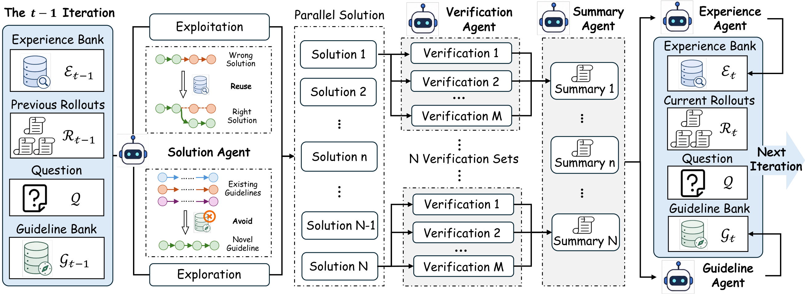
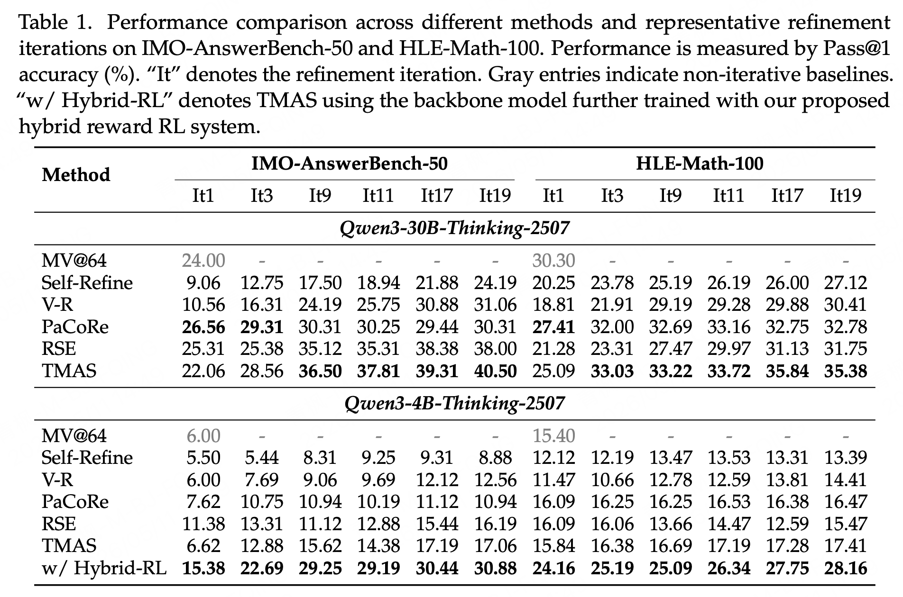
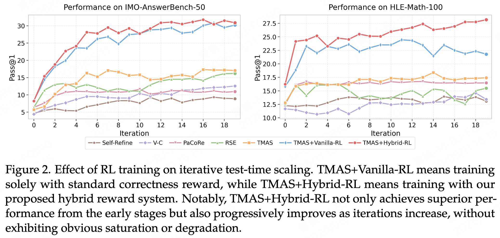

# TMAS: Scaling Test-Time Compute via Multi-Agent Synergy

[](https://arxiv.org/pdf/2605.10344)
<!-- [](https://huggingface.co/unclegeorge/TAMS-Hybrid-RL-4B) -->
<!-- [](https://github.com/george-QF/TMAS-code) -->

> ⚠️ Code, dataset and model checkpoints are currently under internal company review and will be released soon. 🙏

TMAS is a framework for scaling test-time compute via multi-agent synergy for mathematical reasoning. It organizes inference as a collaborative process among specialized agents, enabling structured information flow across agents, trajectories, and refinement iterations.

If you find our work useful, please give us a star ⭐ on GitHub for the latest updates.

## ✨ News
- **[2026.05.11]** 🚀 We release TMAS, a scalable multi-agent framework for test-time compute scaling on mathematical reasoning tasks.

## 💡 Overview

Existing structured test-time scaling methods either weakly coordinate parallel reasoning trajectories or rely on noisy historical information without explicitly deciding what should be retained and reused, limiting their ability to balance exploration and exploitation.

TMAS organizes inference as a collaborative process among five specialized agents, enabling structured information flow across agents, trajectories, and refinement iterations. To support effective cross-trajectory collaboration, TMAS introduces hierarchical me: the Experience Bank reuses low-level reliable intermediate conclusions and local feedback, while the Guideline Bank records previously explored high-level strategies to steer subsequent rollouts away from redundant reasoning patterns.

We further design a **hybrid reward RL scheme** tailored to TMAS, which jointly preserves basic reasoning capability, enhances experience utilization, and encourages exploration beyond previously attempted solution strategies.



## 🤖 TMAS Agents

TMAS decomposes inference-time reasoning into five specialized roles:

| Agent | Role |
|---|---|
| **Solution Agent** | Generates N candidate solutions per iteration; uses ε-greedy policy to mix exploitation and exploration |
| **Verification Agent** | Independently verifies each candidate M times to produce calibrated correctness scores |
| **Summary Agent** | Aggregates M verification results into a concise natural-language summary per candidate |
| **Experience Agent** | Extracts reusable failure analyses from current rollouts; evolves the Experience Bank |
| **Guideline Agent** | Derives high-level solving strategies from current rollouts; evolves the Guideline Bank |

All roles default to the same model endpoint and can be independently assigned to different models via separate API flags.

### Memory Banks

Two persistent stores carry information across iterations for each problem:

- **Experience Bank** (`E_t`): structured records of past mistakes and correction insights, deduplicated by Jaccard similarity.
- **Guideline Bank** (`G_t`): high-level solving strategies that direct the Solution Agent's exploration policy.

Both banks are persisted to disk and can be resumed across interrupted runs.

## 📦 Training Data

The RL training data used in our experiments is released as `RL-training-data.parquet` (4,400 samples).

| Column | Description |
|---|---|
| `prompt` | Input prompt (system + user messages) |
| `data_source` | Problem source (`math` / `math_grm`) |
| `reward_model` | Ground truth and scoring style |
| `extra_info` | Experience Bank and Guideline Bank injected at training time |
| `_source` | Generation mode (`normal` / `experience` / `guideline`) |

The `_source` field reflects the ε-greedy sampling strategy used during trajectory collection: `normal` trajectories use no memory augmentation, while `experience` and `guideline` trajectories are conditioned on the respective memory banks.

## 🧪 Evaluation

We evaluate TMAS on two challenging mathematical reasoning benchmarks provided in `./problems/`:

| Benchmark | # Problems |
|---|---|
| **HLE-Math-100** | 100 |
| **IMO-AnswerBench-50** | 50 | 

Each file is in JSONL format with fields `problem_id`, `question`, and `answer`.


## 📊 Results

Performance comparison (Pass@1 %) on IMO-AnswerBench-50 and HLE-Math-100 across representative refinement iterations.



TMAS achieves stronger iterative scaling than existing TTS baselines, continuing to improve as iterations increase rather than plateauing. Hybrid reward RL further amplifies scaling ability and stability across refinement rounds — notably narrowing the gap between the 4B and 30B models by ~59% at iteration 19.



## 🛠 Setup

```bash
pip install httpx openai rich aiofiles filelock transformers
```

The system communicates with any OpenAI-compatible model API. Set the API key if required:

```bash
export API_KEY="your_api_key"
```

### Input Format

Input files should be JSONL, one problem per line:

```json
{"problem_id": "p1", "question": "Let ..."}
```

## 🚀 Running

Edit `run.sh` to set your model endpoint and paths, then:

```bash
bash run.sh
```

Or invoke directly:

```bash
python code/main.py \
    --input_file ./problems/HLE_MATH_100.jsonl \
    --tokenizer_path ./models/tokenizer \
    --base_url http://YOUR_MODEL_ENDPOINT/v1 \
    --model_name your-model-name \
    --n_candidates 8 \
    --n_verifications 8 \
    --max_iterations 20 \
    --max_tokens 130000 \
    --concurrency 800 \
    --epsilon 0.2 \
    --no_proof \
    --output_file ./results/eval_run1
```

### Key Arguments

| Argument | Description |
|---|---|
| `--input_file` | Path to input JSONL |
| `--output_file` | Output directory (auto-created) |
| `--tokenizer_path` | Path to tokenizer for accurate token counting |
| `--base_url` | OpenAI-compatible API endpoint |
| `--model_name` | Model name served at the endpoint |
| `--n_candidates` | Solutions generated per iteration (N) |
| `--n_verifications` | Independent verification calls per candidate (M) |
| `--max_iterations` | Maximum search iterations |
| `--max_tokens` | Model context window size |
| `--epsilon` | Exploration probability for guideline-directed generation |
| `--no_proof` | Set for numerical-answer problems (outputs `\boxed{}`); omit for proof problems |

### Multi-Model Setup

By default all agents share one endpoint. To assign different models per role:

```
--base_url / --model_name                  (Solution Agent, default for all roles)
--exp_base_url / --exp_model_name          (Experience Agent)
--guide_base_url / --guide_model_name      (Guideline Agent)
--summary_base_url / --summary_model_name  (Summary Agent)
--verify_base_url / --verify_model_name    (Verification Agent)
```

### Resuming a Run

```bash
python code/main.py \
    --resume_path ./results/eval_run1 \
    --max_iterations 20 \
    ... (same other arguments)
```

`--max_iterations` is interpreted as the **total** target iteration count when resuming.

## 📄 Citation

```bibtex
@article{wu2026tmas,
  title={TMAS: Scaling Test-Time Compute via Multi-Agent Synergy},
  author={Wu, George and H.Yu, Xavier and Yang, Evan and Hao, Chuan and Yang, Ming and Chang, Feng and Wei, Yuan and Yang, Jian and Tao, Ran and Dai, Bryan},
  journal={arXiv preprint arXiv:PLACEHOLDER},
  year={2026}
}
```
